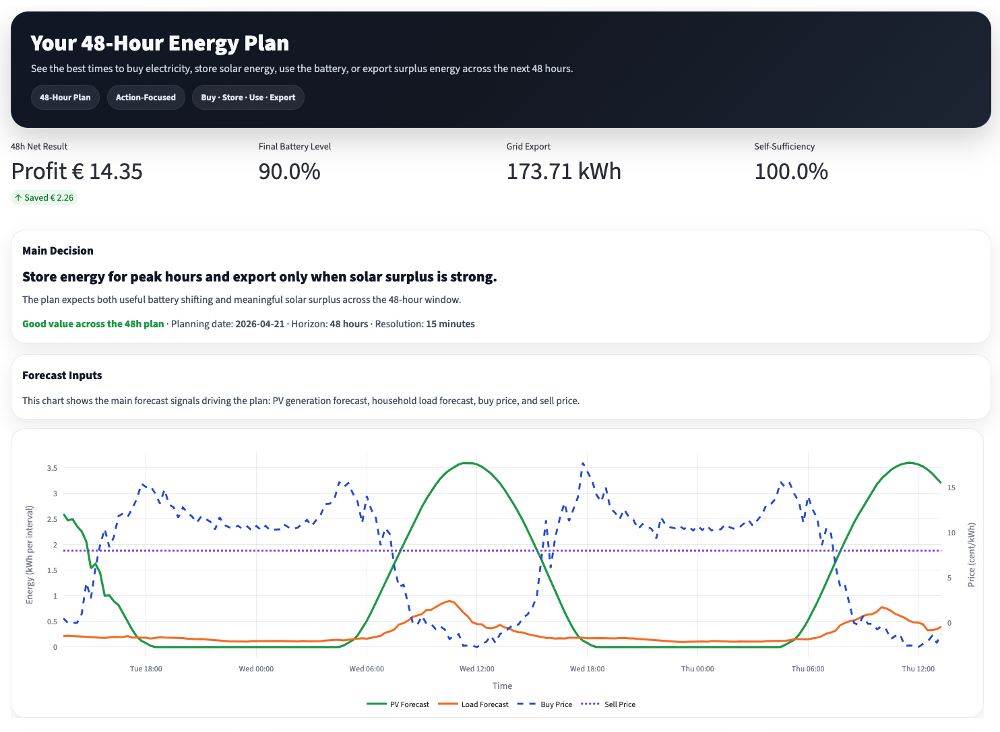

[](https://github.com/joschamz/hems-automation/actions/workflows/workflow-02.yml)


# Home Energy Management System (HEMS) Automation

> **Capstone Project** — The central thesis of this project is simple: **you cannot optimize what you cannot predict**. A home battery system without forecasting can only react to the present — charging when the sun shines now, discharging when prices are high now. This system instead looks 48 hours ahead, combining machine-learned load predictions, solar irradiance forecasts, and real day-ahead electricity prices to solve for the globally optimal charge/discharge schedule via linear programming. The result is an energy flow that is simultaneously more **financially profitable** (minimizing grid cost through price arbitrage) and more **climate-friendly** (maximizing self-consumption of renewable solar energy and reducing grid dependency).

---

## Dashboard Demo

### Forecasting as the Foundation for Optimization

Most home battery systems operate on simple rules: charge when solar is available, discharge when needed. This works — but it leaves significant value on the table. The key insight this project demonstrates is that **forecasting unlocks optimization**:

- Without a load forecast, the battery cannot anticipate a high-consumption evening peak and pre-charge during cheap midday hours.
- Without a solar forecast, the system cannot decide whether to store energy now or wait for tomorrow's stronger irradiance.
- Without day-ahead prices, arbitrage — buying cheap, selling or avoiding expensive grid energy — is impossible.

By combining all three forecasts into a single 48-hour horizon and solving a linear program over it, the system finds the schedule that **minimizes electricity cost and maximizes solar self-consumption simultaneously**. This dual objective makes the system both financially profitable for the homeowner and environmentally beneficial by reducing grid draw during high-emission periods.

The dashboard makes this optimization transparent and inspectable:
- **When should the battery charge or discharge?** → Solved globally across 192 slots, not slot-by-slot
- **How much energy will the solar panels generate?** → 48-hour irradiance forecast via Open-Meteo API
- **What will the household consume?** → LightGBM model trained on historical 15-min consumption data
- **How much better is the optimized plan vs. a simple rule?** → Side-by-side cost delta between LP and threshold heuristic

### What It Showcases

The interactive dashboard demonstrates:

1. **01_Plan — 48-Hour Optimization Schedule**
   - Charge/discharge recommendations per 15-min slot
   - Battery state-of-charge (SoC) trajectory overlaid with electricity prices
   - Solar generation vs. household load comparison
   - KPI metrics: estimated cost savings, self-sufficiency ratio, final SoC
   - Day 1 & Day 2 summary cards with headline numbers

2. **Energy Story — Energy Flow Narrative**
   - Hour-by-hour energy flow visualization (animated bars)
   - Solar's role: direct consumption, storage, and grid export
   - Battery's role: total energy cycled and arbitrage value
   - Tells the "story" of how energy moved through the system

3. **System Center — Configuration & Diagnostics**
   - Real-time artifact health monitoring (file status, row counts, timestamps)
   - Configuration inspector for physical system parameters (PV peak power, battery capacity, efficiency)
   - Data browser for any runtime CSV (aggregated forecast, dispatch schedule, history logs)

### Dashboard Preview



---

## System Architecture

```
  Raw Load Data (CSV)
        │
        ▼
  Feature Engineering
  (timestamp slicing,
   cutoff to current time)
        │
        ▼
  LightGBM Training          ← runs once per day
  (multi-output regression,
   household load forecast)
        │
        ▼
  48-Hour Load Forecast
        │
        ├──────────────────────────────────────────────┐
        │                                              │
        ▼                                              ▼
  Solar Forecast                           Day-Ahead Prices
  (Open-Meteo API,                         (ENTSOE Transparency API,
   clear-sky fallback)                      DE_LU bidding zone)
        │                                              │
        └──────────────┬───────────────────────────────┘
                       ▼
          Aggregated Forecast Table
          (192 rows × 15-min UTC,
           load + solar + prices)
                       │
                       ▼
          ┌────────────────────────────┐
          │   Dispatch Optimization    │
          │  ───────────────────────   │
          │  LP (linprog):             │
          │   minimize grid cost       │
          │   subject to SoC bounds,   │
          │   charge/discharge limits, │
          │   and energy balance       │
          │                            │
          │  Rule-based baseline       │
          │   (threshold heuristic)    │
          └────────────────────────────┘
                       │
                       ▼
          Dispatch Table + History
          (runtime/ and history/)
                       │
                       ▼
          Streamlit Dashboard
          ┌──────────────────────────────────────────┐
          │  01_Plan         │  Energy Story         │
          │  (48h schedule,  │  (flow narrative,     │
          │   KPIs, charts)  │   animated bars)      │
          ├──────────────────┴───────────────────────┤
          │  System Center (config, artifact health, │
          │  data browser)                           │
          └──────────────────────────────────────────┘
```

---

## Quick Start

### 1. API Key

Register for a free ENTSOE Transparency Platform account at [transparency.entsoe.eu](https://transparency.entsoe.eu) and place your API key (UUID format) in:

```
secrets/entsoe_api_key.txt
```

> The `secrets/` folder is tracked by git, but all files inside it are git-ignored.

### 2. Environment Setup

**macOS**

Install the OpenMP runtime required by LightGBM, then create the virtual environment:

```bash
brew install libomp
./scripts/setup.sh
source .venv/bin/activate
```

Manual alternative:

```bash
pyenv local 3.11.3
python -m venv .venv
source .venv/bin/activate
python -m pip install --upgrade pip
pip install -e ".[dev]"
```

> If LightGBM was imported before `libomp` was installed, restart the kernel once.

**Windows** (requires [pyenv-win](https://github.com/pyenv-win/pyenv-win))

PowerShell:

```powershell
pyenv local 3.11.3
python -m venv .venv
.venv\Scripts\Activate.ps1
python -m pip install --upgrade pip
pip install -e ".[dev]"
```

Git Bash:

```bash
pyenv local 3.11.3
python -m venv .venv
source .venv/Scripts/activate
python -m pip install --upgrade pip
pip install -e ".[dev]"
```

> If `pip install --upgrade pip` fails on Windows, use `python.exe -m pip install --upgrade pip`.

### 3. Configuration

Edit `user_config.json` to match your physical installation:

| Key | Description | Example |
|-----|-------------|---------|
| `lat` / `lon` | Site coordinates | `47.66` / `9.18` |
| `kwp` | Installed PV peak power (kWp) | `20.0` |
| `tilt` / `azimuth` | Panel tilt (°) and azimuth (0 = south) | `35` / `0` |
| `yield_factor` | System efficiency factor (0–1) | `0.7` |
| `battery_capacity_kwh` | Usable battery capacity | `13.5` |
| `max_charge_kw` / `max_discharge_kw` | Maximum charge/discharge power | `5.0` |
| `charge_efficiency` / `discharge_efficiency` | Round-trip efficiency factors | `0.9` |
| `soc_min_kwh` / `soc_max_kwh` | State-of-charge operating bounds | `1.35` / `12.15` |

`system_config.json` controls pipeline behaviour (forecast horizon, dispatch interval, LP solver parameters, grid-charging policy).

### 4. Run the System

Start the full orchestrator (training → forecast → dispatch → UI):

```bash
python src/main.py
```

The orchestrator:
1. Prepares and time-slices the training dataset up to the current 15-minute slot.
2. Trains (or retrains daily) a LightGBM household load model.
3. Builds a 48-hour aggregated forecast table (load + solar + prices, 192 rows × 15-min UTC).
4. Runs LP dispatch optimization and saves the dispatch schedule.
5. Launches the Streamlit dashboard automatically at `http://localhost:8501`.

From then on, the forecast and dispatch steps repeat every 15 minutes in a continuous loop.

> Development-only (dashboard without retraining): `streamlit run 01_Plan.py`

---

## Process Lifecycle & Artifacts

| Artifact | Path | Produced by | Consumed by |
|----------|------|-------------|-------------|
| Feature-engineered input | `data/input/shifted-date-residential1_feature_engineered_full.csv` | Offline (provided) | `prepare_data()` |
| Trimmed training dataset | `data/load_training_dataset.csv` | `prepare_data()` | `train_module()` |
| Trained load model | `models/load_forecast_model_*.pkl` | `train_module()` | `build_aggregated_table()` |
| Aggregated forecast table | `data/runtime/aggregated_table.csv` | `build_aggregated_table()` | `run_dispatch()`, 01_Plan.py |
| Dispatch schedule | `data/runtime/dispatch_table.csv` | `run_dispatch()` | All dashboard pages |
| Historical dispatch log | `data/history/history_dispatch_table.csv` | `save_history()` | Energy Story, System Center |
| Historical aggregated log | `data/history/history_aggregated_table.csv` | `save_history()` | System Center |

---

## Data Science Methods

### Load Forecasting

- **Feature engineering**: timestamp features (hour, day-of-week, month), lag features, and rolling statistics are pre-computed offline into `shifted-date-residential1_feature_engineered_full.csv`.
- **Model**: LightGBM multi-output gradient boosting regressor trained on historical household consumption at 15-minute resolution.
- **Inference horizon**: 48 hours (192 slots) from the current 15-minute boundary, rolled forward every cycle.
- **Retraining**: The model is retrained once per calendar day using all available data up to the current timestamp, and old model files are pruned (keeping the 3 most recent).

### Solar & Price Forecasting

- **Solar**: Open-Meteo API (no API key required). Irradiance is converted to estimated generation using panel parameters from `user_config.json`. Falls back to a clear-sky approximation if the API is unavailable.
- **Day-ahead prices**: ENTSOE Transparency API (DE_LU bidding zone), returned in EUR/MWh and ct/kWh. If D+1 prices have not yet been published (typically before ~13:00 CET), the function returns `NaN` rows with `source="not_published"` rather than raising an error.

### Dispatch Optimization

The dispatch step solves two strategies over the 48-hour horizon and stores both in the dispatch table for comparison:

**LP Optimization** (`scipy.optimize.linprog`):
- **Objective**: minimize total grid electricity cost over the horizon.
- **Decision variables**: grid import, grid export, battery charge, battery discharge per 15-min slot.
- **Constraints**: energy balance (load = solar + grid import + discharge − charge), SoC continuity, SoC bounds (`soc_min_kwh` to `soc_max_kwh`), charge/discharge rate limits, non-negativity.

**Rule-Based Baseline**:
- Threshold heuristic — charge when solar surplus is available, discharge when prices exceed a configurable threshold, otherwise idle. Serves as a cost-delta benchmark against the LP solution.

### KPI Reporting

Both strategies produce per-slot and aggregated KPIs including: grid import/export volumes, battery SoC trajectory, estimated electricity cost, self-sufficiency ratio, and the cost delta between rule-based and LP strategies.

---

## Dashboard Guide

### `01_Plan.py` — 48-Hour Decision Plan

The main planning view. Loads automatically on startup.

- **Hero card**: Day 1 / Day 2 summary with total cost, self-sufficiency, and final SoC.
- **Action timeline**: per-slot recommended action (charge / discharge / idle / export) color-coded by mode.
- **KPI metrics**: headline numbers for cost savings and self-consumption.
- **Charts**: battery SoC trajectory overlaid with electricity price curve; solar generation vs. household load.

### `pages/02_Energy Story.py` — Energy Flow Narrative

A narrative interpretation of how energy moved through the system on the selected planning day.

- **Solar role**: fraction of load met by direct solar, solar stored, solar exported.
- **Battery role**: total energy cycled, net arbitrage value.
- **Animated flow bars**: hour-by-hour energy flow visualization rendered via `streamlit.components`.

### `pages/03_System Center.py` — System Configuration & Monitoring

Operational control panel.

- **Config editor**: inspect and validate `user_config.json` and `system_config.json` parameters.
- **Artifact health**: status of all runtime and history CSV files (exists, row count, last modified).
- **Data browser**: load and inspect any artifact table in-page.

---

## Notebooks

Exploratory and utility notebooks are in `notebooks/`. Run from the project root so that relative paths to `data/`, `models/`, and config files resolve correctly:

```bash
jupyter lab
```

| Notebook | Purpose |
|----------|---------|
| `example_solar_utility.ipynb` | Solar utility API usage, source handling, and output validation |
| `example_prices_utility.ipynb` | ENTSOE price utility usage and 48h UTC output checks |
| `example_weather_utility.ipynb` | Weather utility pipeline demo (raw fetch -> 15-min interpolation -> derived features) |
| `example_dispatch_utils.ipynb` | End-to-end aggregated-input and dispatch-utils walkthrough (rule-based vs LP) |
| `household_load-trained_model.ipynb` | LightGBM household load model training walkthrough |
| `eda_household_load.ipynb` | Exploratory data analysis of household load patterns |

---

## Reproducibility & Limitations

- **External API dependency**: Price data requires a valid ENTSOE API key and network access. Solar data requires Open-Meteo availability. Both utilities have graceful fallbacks but forecast quality degrades without live data.
- **Fixed training dataset**: The feature-engineered input file is a static offline artifact. The system does not ingest live meter readings; the time-slice cutoff simulates a rolling production scenario.
- **No hardware integration**: The system generates schedules but does not interface with real battery management systems, inverters, or smart meters. It is a decision-support prototype.
- **Development environment**: Dev dependencies are bundled with production dependencies. In a production deployment these would be separated.
- **Prototype scope**: This project is a capstone demonstration of the full ML + optimization + UI pipeline. It is not hardened for unattended production operation.

---

